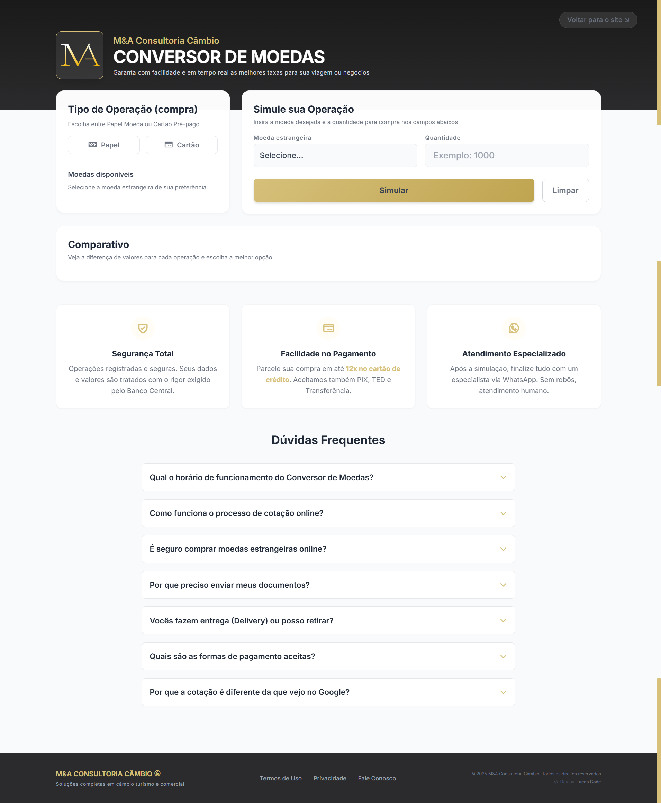

<div align="center">


# Plataforma de Câmbio • M&A Consultoria

**Plataforma de automação de operações cambiais para corretora de câmbio turismo**

*Solução client-side com regras bancárias reais e integração em tempo real*

[]()&nbsp;
[]()&nbsp;
[](./LICENSE)

</div>

<p align="center">
  <a href="#projeto">Projeto</a>&nbsp;&nbsp;&nbsp;|&nbsp;&nbsp;&nbsp;
  <a href="#funcionalidades">Funcionalidades</a>&nbsp;&nbsp;&nbsp;|&nbsp;&nbsp;&nbsp;
  <a href="#tecnologias">Tecnologias</a>&nbsp;&nbsp;&nbsp;|&nbsp;&nbsp;&nbsp;
  <a href="#estrutura">Estrutura</a>
</p>

<h2 id="projeto">PROJETO</h2>

Sistema desenvolvido para transpor as necessidades específicas da M&A Consultoria para o ambiente digital. Diferente de conversores genéricos, a aplicação segue normas bancárias reais e regras de negócio rigorosas, onde toda a lógica e interações acontecem no navegador, sem recarregar a página, em arquitetura SPA-like sem uso de frameworks.

🌐 [Acesse a aplicação](https://cotacaoonline.maconsultoriacambio.com.br/)

<p align="center">
  
</p>

<h2 id="funcionalidades">FUNCIONALIDADES</h2>

- **Cotações em tempo real** — integração com Google Sheets API para atualização dinâmica de taxas
- **Cálculos financeiros** — processamento automático de IOF, VET e custo total da operação
- **Inteligência de mercado** — algoritmo que valida horário comercial e feriados bancários móveis e fixos
- **Sincronização de fuso horário** — conversão forçada para America/Sao_Paulo em acessos internacionais
- **Arquitetura Fail-Safe** — bloqueio de operações caso a fonte de dados esteja inacessível ou obsoleta
- **Fluxo de solicitação** — envio de confirmações transacionais via EmailJS para cliente e administrador
- **Sanitização RegEx** — validação e formatação automática de CPF, telefone e CEP
- **Experiência do Usuário (UX)** — Fluxo didático e simplificado, com seção de FAQ para apoio ao usuário
- **Interface responsiva** — design minimalista focado na clareza das informações

**Considerações técnicas**
- Toda a lógica de negócio é executada no client-side por decisão arquitetural, visando performance, controle e redução de dependências de backend
- A Google Sheets API foi adotada como BaaS por atender aos requisitos de confiabilidade, versionamento e atualização operacional do cliente

<h2 id="tecnologias">TECNOLOGIAS</h2>

| Tecnologia | Uso |
|---|---|
| HTML5 | Estrutura semântica e acessível |
| CSS3 | Estilos base e customizações |
| Tailwind CSS | Estilização utilitária |
| JavaScript ES6+ | Lógica central, DOM e lógica temporal |
| Google Sheets API | Backend as a Service para gestão de taxas |
| EmailJS | Envio de e-mails transacionais |
| Phosphor Icons | Biblioteca de ícones da interface |
| Git/Github | Versionamento e hospedagem |

<h2 id="estrutura">ESTRUTURA</h2>

```
cambio-online-turismo/
├── assets/
│   └── img/             → Logotipos e assets visuais
├── src/
│   ├── css/
│   │   └── style.css    → Variáveis CSS e estilos customizados
│   └── js/
│       └── script.js    → Core do sistema
├── index.html           → Interface principal
├── CNAME                → Configuração de domínio personalizado
├── LICENSE
└── README.md
```

---

<h2>LICENÇA</h2>

Este projeto possui uma **licença personalizada**. O código está disponível para consulta pública e portfólio, porém é proibida sua reprodução, cópia ou uso comercial sem autorização expressa de Lucas Code e M&A Consultoria Câmbio.

Veja o arquivo [LICENSE](./LICENSE) para mais detalhes.

<h2>AUTOR</h2>

Desenvolvido por [Lucas Couto](https://linkedin.com/in/lucas-coutoti).  
Conheça meu trabalho em [Lucas Code](https://bio.site/lucascode).
